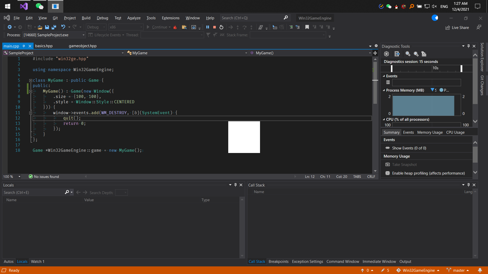

# Win32GameEngine 指南

## 简介

Win32GameEngine 是一个基于 Win32 API 的游戏框架，完全使用原生 C++ 实现。
它同时支持 Unity 的子类成员方法复写和 JavaScript 的事件监听器模式，开发者可以相对自由地选择自己喜欢的开发范式。

## 历史

此框架最早出现是因为大一下学期（2021 上半年）韩红雷老师的游戏程序设计基础课经常留 Win32 的程序设计作业。
基于 C 的 Win32 项目开发实在是精神折磨，于是我愤而用 C++ 包装了一些浅而松散的类出来，虽然还不足以独立成为一个框架，但足以应付一学期的实践作业了。

转眼到了大二上（2021 下半年），课表里出现了徐婵婵老师的面向对象编程课，这回讲的是 C++。
第一节课上，老师说已经有 C++ 经验的同学可以用以往的作品申请不用来上课。
于是我把之前包装的 Win32 轮子交了上去，成功躲过了晚十的折磨。

划了一学期的水后，本以为结课作业会是自己实现一个基于 OOP 的程序什么的，结果居然又是开发 Win32 游戏。
老师给我们提供了一套之前的师哥写的轮子，说可以借助这个开发，但一定要在代码里体现 OOP 的思想。
我翻了翻这套轮子的代码，大抵的功能倒是都实现了，但结构还是完全过程式的，也没有可以查阅的文档。
直接用它开发，相比会花费不少功夫在头文件之间痛苦横跳。
我自然又想到了自己写的轮子，但那不足以担负起系统化游戏开发的重任。
于是我决定只保留与 Win32 API 交互的核心代码，而将整个结构基于现代游戏引擎的范式推翻重来。

## 源码总览

这是一段极简单的程序，可以当作 Win32GameEngine 的 `hello, world`：
```C++
#include "win32ge.hpp"

using namespace Win32GameEngine;

class MyGame : public Game {
public:
	MyGame() : Game(new Window({
		.size = {100, 100},
		.style = Window::Style::CENTERED
	})) {
		window->events.add(WM_DESTROY, [&](SystemEvent) {
			quit();
			return 0;
		});
	}
};

Game *Win32GameEngine::game = new MyGame();
```
编译运行之，可以看到一个白色的正方形浮在屏幕的正中央：这是这段代码创建的窗体。



让我们逐行地看看这段代码都写了什么吧！

根据微软官方文档，一个 Win32 程序的入口点函数应该是 `int WINAPI wWinMain(HINSTANCE, HINSTANCE, PWSTR, int)`。
很明显，这段源码里并没有出现任何入口点函数的实现甚至是签名。
那么程序是如何正确编译运行的呢？
答案是，Win32GameEngine 在 `win32ge.hpp` 里给出了入口点函数的实现，托管了游戏的初始化、主循环等一切行为。

游戏的运行时实例由 `Game *Win32GameEngine::game` 所引用。
开发者只需要在源文件中自 `Win32GameEngine::Game` 派生出自定义的子类，创建一个实例赋给 `game` 即可。

本例中，派生出来的子类是 `MyGame`。
它在构造时创建了一个 `Win32GameEngine::Window` 类的实例，作为参数传给了父类的构造函数。
这将作为程序的主窗体。
创建窗体的参数以结构体的方式相当明确地罗列出来[^1]，详细参数可以参阅 `Window::InitArg` 的定义。

[^1]: 根据属性名初始化结构体需要在 Visual Studio 中开启 C++ 的最新语法特性。

主窗体创建完成后，构造函数紧接着为它绑定了摧毁时的事件：退出游戏。
出于实际开发需求上的考虑，Win32GameEngine 并没有将粗暴的硬终止逻辑预设在框架里。
当触发 `WM_DESTROY` [^2]时，窗体会被系统强制关闭；但游戏主循环则要到 `void Game::quit()` 被调用时才会退出，开发者可以手动决定游戏的终止时机，亦可以在之后安排善后工作。

本例中，我们并不需要考虑终止后的工作，因此直接将 `WM_DESTROY` 与 `quit()` 相绑定。
绑定事件的方法 `window->events.add(...)` 接受两个参数：事件类型和回调函数。
这里的回调函数由 [lambda 表达式](https://docs.microsoft.com/zh-cn/cpp/cpp/lambda-expressions-in-cpp)给出。

[^2]: 这是一个 Win32 事件。